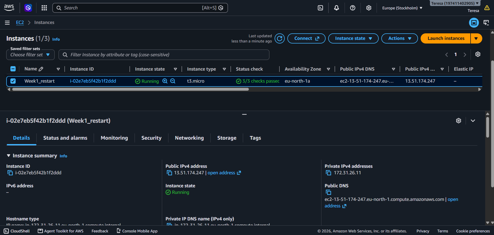
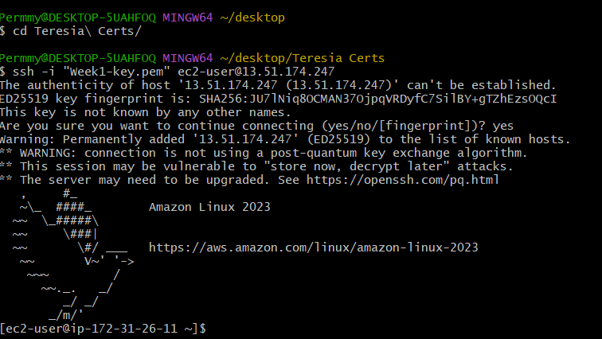
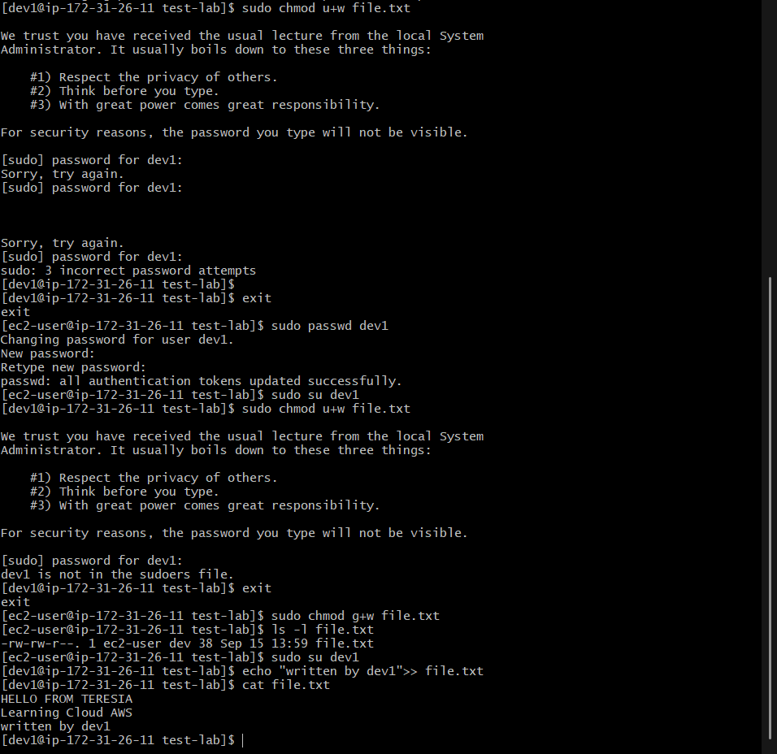
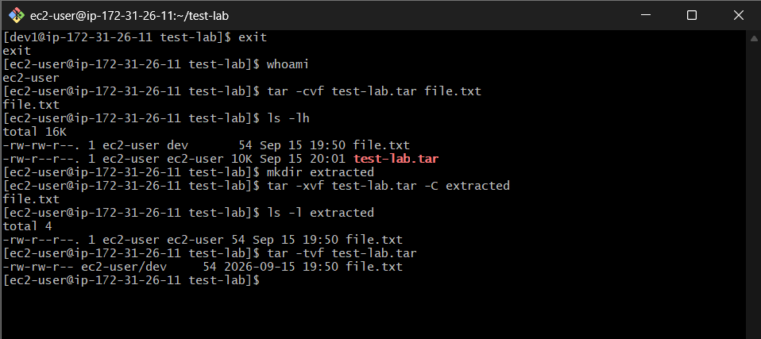
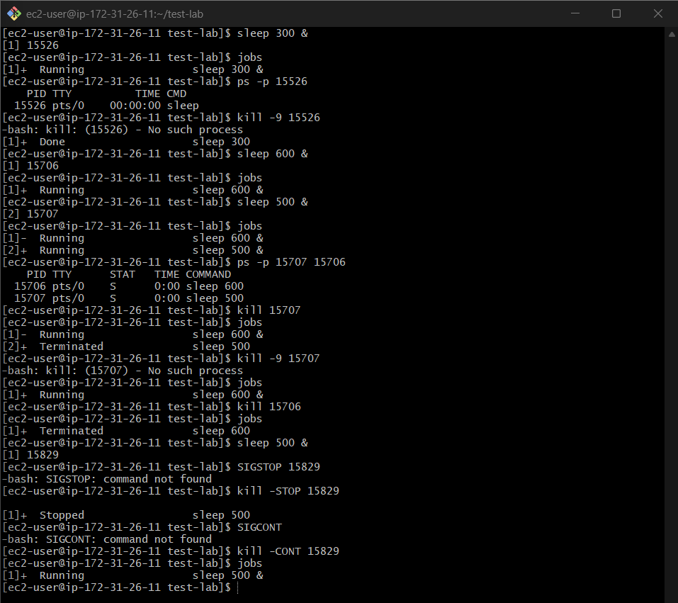

# AWS re/Start Journey – Week 1 & Week 2

## Cloud Foundations & Linux

During Week 1 and Week 2 of AWS re/Start, I learned the fundamentals of cloud computing, AWS, and Linux. I combined the two weeks in this section because I applied the cloud concepts by launching and working with a Linux EC2 instance.

### What I Practiced

I started by learning the basics of cloud computing and AWS, including how cloud resources are provided on demand and how AWS organizes its infrastructure using Regions and Availability Zones.

I then launched an Amazon EC2 instance running Amazon Linux 2023 and connected to it remotely using SSH. I practiced navigating the Linux filesystem and explored directories such as `/home`, `/root`, `/tmp`, and `/`.

I also practiced Linux users, groups, file ownership, and permissions. I created a user and group, added the user to the group, and used `chmod` and `chown` to control access to files. I tested the permissions by switching between users and seeing what each user could and could not do.

I practiced creating and extracting archives with `tar`, and learned how pipes, `grep`, and `tee` can be combined to process and save command output.

I also worked with Linux processes. I used `ps` and `ps aux` to view processes, found processes using `grep`, and practiced starting, stopping, resuming, and terminating processes using signals.

For system monitoring, I used `top`, `df`, and `du` to observe running processes, CPU and memory usage, filesystem space, and directory usage.

I also started learning how Linux services are managed with `systemctl`, including checking whether services are running and whether they are enabled to start automatically.

### What I Learned

The practical labs helped me understand Linux beyond individual commands. I learned how users, groups, permissions, processes, services, and filesystems work together when managing a Linux server.

I also learned that troubleshooting is part of working with Linux. Some of my commands did not work as expected, which helped me understand the difference between commands, permissions, users, groups, and processes instead of simply memorizing commands.

### Practical Evidence

#### AWS EC2

#### Linux Permissions & Troubleshooting

#### File Archiving

#### Process Management

## Key Takeaways

The practical work helped me understand how cloud concepts connect to Linux server administration.

I learned how to connect to an EC2 Linux server using SSH, navigate the filesystem, manage users and groups, control file permissions, create archives, work with command output, monitor processes and system resources, and check Linux services.

One of the biggest lessons was troubleshooting. I encountered permission errors, unavailable commands, incorrect command usage, and process-related errors. Instead of only correcting the commands, I used the errors to understand why the commands behaved differently from what I expected.

This gave me a better foundation for working with Linux and cloud infrastructure.
